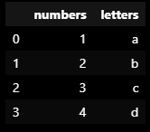

# Intro to Data Analytics with Python and Pandas


## Installation 

### Installing pandas

use this code syntax `pip install --proxy http://sub.proxy.att.com:8888 --trusted-host pypi.python.org --trusted-host files.pythonhosted.org --trusted-host pypi.org <name of package>` to install the following packages:

-pandas
-scipy
-numpy
-plotly

** remember that to use any of these libraries, you must import them at the top of the script, ex. `import pandas as pd` 
### Python notebooks

A notebook is a way to write and run python code that allows you to execute individual sections of code without running the entire script. 

To use notebooks within VSCode, click on extensions on the left bar of VSCode, search for "Jupyter" and install the extension called Jupyter.

### Pandas

Pandas is a python library that allows you to create and manipulate dataframes. Dataframes are a data object that stores data as series (aka columns).

Documentation: https://pandas.pydata.org/docs/getting_started/index.html

Cheat Sheet: https://pandas.pydata.org/Pandas_Cheat_Sheet.pdf

## Reading in data, group-by's, and bar charts

### What are dataframes?

DataFrames are 2-dimensional data structures, like a 2-dimensional array, or a table with rows and columns. 

Example: creating a simple Pandas DataFrame

input: 

```
series1 = pd.Series([1,2,3,4])
series2 = pd.Series(['a', 'b', 'c', 'd'])

data_frame = pd.DataFrame({'numbers': series1, 'letters': series2})

```

output:




### Reading in data

Pandas allows you to create dataframes from files, including csv, json, html, excel, sql, and pickle files. 

General syntax for reading in data files as data frames:
`data_frame = pd.read_<data type>('<file path>')`

example:

`data frame = pd.read_csv('data.csv')`

### Inspecting data

Print out dataframes with `data_frame.head()`.
* defaults to showing top 10 rows, pass number param. to increase or decrease. Ex. `data_frame.head(5)` prints top 5 rows

Print out description statistics of data_frame with `print(data_frame.describe())` 
* yields count, mean, std, min, quartiles, and max for each column

Count the number of rows with a unique value of each variable with `data_frame['<column name>'].value_counts()`

Count number of rows in the dataframe with `len(data_frame)`

### Cleaning data

Sort values: `data_frame.sort_values('<column name>', ascending=<True or False>)` 

Rename columns: `data_frame.rename(columns = {'<column name>': '<new neame>'})`

Sort index: `data_frame.sort_index()`

Reset index: `data_frame.reset_index()`

Drop column: `data_frame.drop(columns=['<column name>', '<column name>'])`

Drop duplicate rows: `df.drop_duplicates()`

### Group-bys

Groupby functions group data by a column, and return a groupby object. It works similar to pivot tables in Excel.

Group dataframe by a column: `data_frame.groupby(by='<column name')`

### Plotly Express

Plotly is a Python visualization library. Plotly Express is built off of Plotly that is easier to use but allows less customization than plain Plotly. Find cheat sheet here: https://www.datacamp.com/cheat-sheet/plotly-express-cheat-sheet

General plotting syntax:

```
import plotly.express as px


fig = px.plotting_fn(dataframe, # Dataframe being visualized
    x=["column-for-x-axis"], # Accepts a string or a list of strings
    y=["columns-for-y-axis"], # Accepts a string or a list of strings
    title="Overall plot title", # Accepts a string
    xaxis_title="X-axis title", # Accepts a string
    yaxis_title="Y-axis title", # Accepts a string
    width=width_in_pixels, # Accepts an integer
    height=height_in_pixels) # Accepts an integer

fig.show() #prints out fig
```


